Built in Modules
================

Analog
------

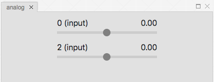

The analog module is used to display digital outputs and control the value of digital inputs with sliders.

Auto Chooser
------------

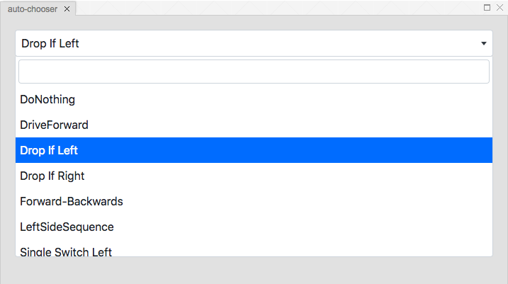

If you have multiple autonomous modes you can pick one using the auto chooser module.

CAN
---

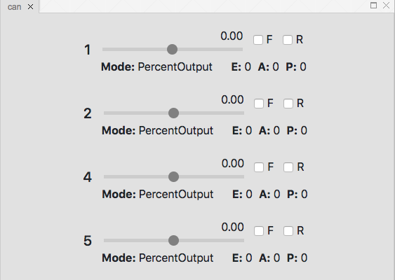

CAN devices such as the Talon SRX are simulated using the CAN module.

Mode Picker
-----------

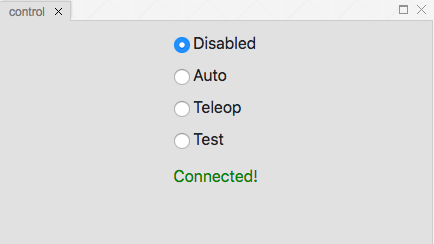

You can select the robot mode using the mode picker. For example, if you want to test your autonomous code you can select the *Auto* radio button.

Digital
-------

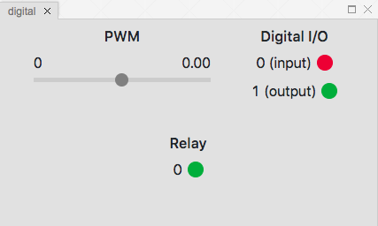

The digital module simulates digital devices such as PWMs, Digital I/Os, and Relays.

Encoder
-------

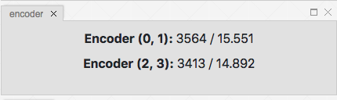

Shows source channels, count, and distance traveled for simulated encoders. Encoder counts can be set in the ``MyUserPhysics`` class in the ``physics.js`` file.

Field
-----

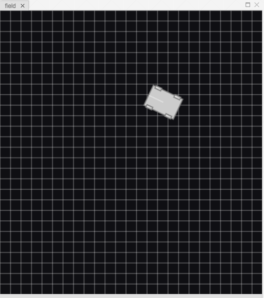
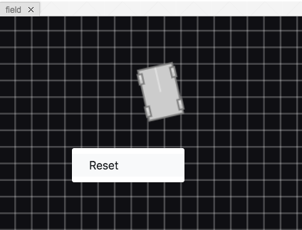

The field module is where the simulated robot physics happens. You can reset the field by opening the context menu and clicking the ``Reset`` menu item.

Game Data
---------

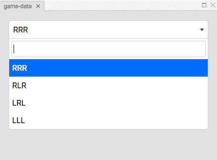

The game data module is used to set the game specific message.

Gyro
----

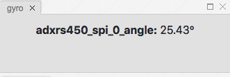

The gyro module is used to display the simulated gyro values. The gyro value is set using the simulated robot in the field module.

Joystick
--------

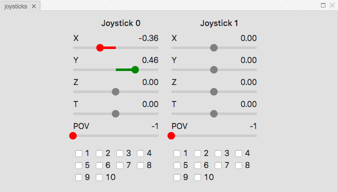

The joystick module is used to simulate joystick values. Axes are set using sliders and buttons are set using checkboxes. Joystick axes and buttons can also be set using plugged in gamepads.

Solenoid
--------

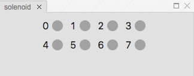

The solenoid module is used to get simulated solenoid values.

Tableviewer
-----------

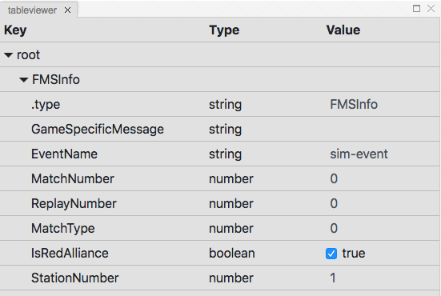
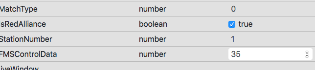
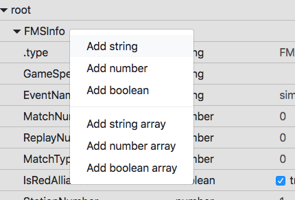
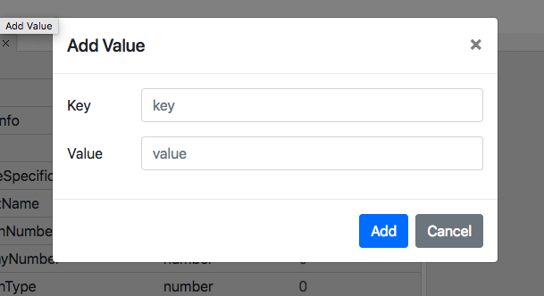

Tableviewer is used to display and set Networktable values. Carets can be clicked to expand subtables. Values can be edited by clicked on the value column and added from modals which can be opened from the context menu.

Time
----

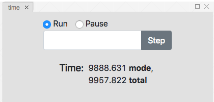
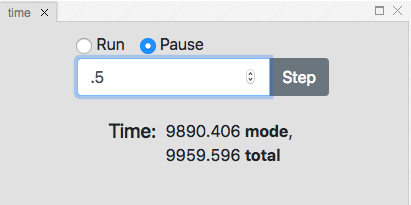

The time module can be used to view the time spent in total and in the current mode, pause the sim, and step forward a certain amount of time in the simulation.