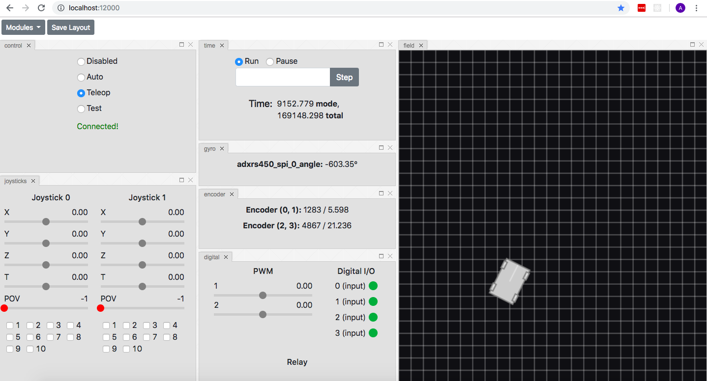
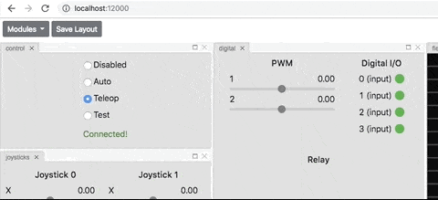
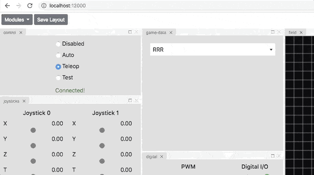
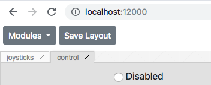

Interface
=========

The websim interface is made up of containers called modules that can be dragged and dropped, exited, and organized into rows, columns and stacks. Modules contain inputs, controls, labels, and other components that allow you to interact and get information from a simulated robot.

Dragging and Dropping
---------------------

To add modules to the interface you must open the module menu and drag and drop them onto the interface.

Organizing Layout
-----------------

Modules placed on the layout can be organized and rearanged into rows, columns and stacks.

Saving Layout
-------------

To save the layout click the ``Save Layout`` button next to the module menu. The layout data is saved to the ``user-config.json`` file in the ``sim`` folder parallel to your ``robot.py`` file.

Golden Layout
-------------

The websim uses a mult-window javascript layout manager called **Golden Layout**. Visit their `site <https://golden-layout.com/>`_ to learn more about how **Golden Layout** works.